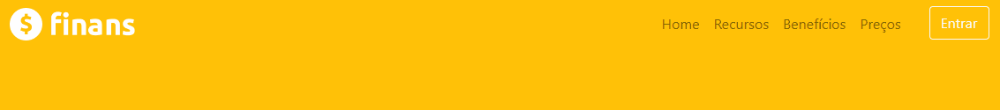

# Finans
[]
O projeto Finas é a página inicial para uma agência financeira! Este 
projeto foi criada usando HTML, CSS e Bootstrap para fornecer uma 
interface amigável e fácil de usar para nossos usuários. A página 
fornece informações sobre os serviços financeiros,incluindo suporte para investimentos e soluções de crédito. Além disso, oferece aos usuários acesso a recursos úteis e informações financeiras para ajudá-los a tomar decisões informadas sobre seus investimentos. 💵💰🫰
 
 
 
## Requesitos 🛠️

Para executar esse projeto de página inicial para uma agência financeira, você precisará dos seguintes requisitos:

* Navegador web atualizado (Google Chrome, Mozilla Firefox, Safari, etc.) Conexão com a Internet.

* Conhecimento básico em HTML, CSS e Bootstrap.

* Editor de código (Sublime Text, Visual Studio Code, etc.).

* Conta gratuita no Bootstrap (opcional, mas recomendado para aproveitar ao máximo as funcionalidades do framework).

Esses são os requisitos básicos para executar esse projeto. Além disso, você pode precisar instalar outros softwares ou bibliotecas, dependendo das funcionalidades adicionais que você deseja implementar.

## Créditos
Pedro Joaquim Araujo (@pedrojoaquim97)
